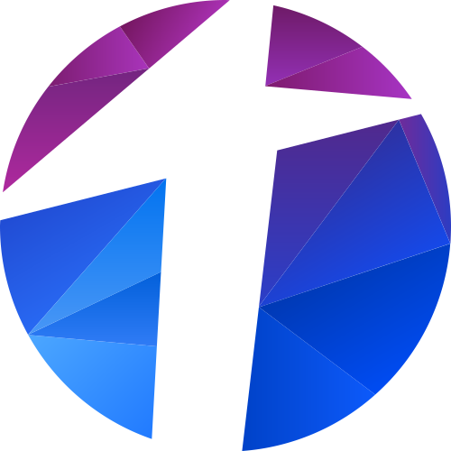
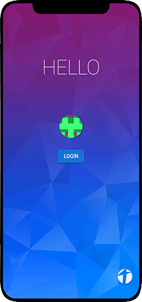
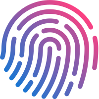
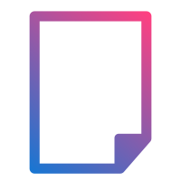
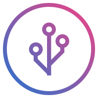
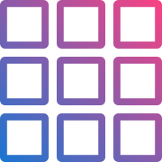

    

[App](https://totem.app) |
[Homepage](https://totem.network) |
[Blog](https://blog.totem.network)

__Totem - Your digital life in one app!__

The vision of Totem is creating a progressive web app to store your personal
data like your photos, music, videos, finances, documents, chats and much more
in a secure place. Furthermore it allows you to use this data with artificial
intelligence or simple programs on your terms to make your digital life a bit
more comfortable without compromising on your right of privacy.

To achieve this goal Totem is based on decentralized technolgies like
blockchain (Ethereum) and IPFS. All software is open source and released
under GPL version 3 license.

__This is alpha software! Not all features are implemented completly!__

## 🚩 Contents

- [🚩 Contents](#%f0%9f%9a%a9-contents)
- [🔭 Screenshots](#%f0%9f%94%ad-screenshots)
- [🚀 Getting Started](#%f0%9f%9a%80-getting-started)
- [💻 Requirements](#%f0%9f%92%bb-requirements)
- [🎨 Features](#%f0%9f%8e%a8-features)
- [🙌 Contribute](#%f0%9f%99%8c-contribute)
- [✨ Sponsors](#%e2%9c%a8-sponsors)
- [📜 License](#%f0%9f%93%9c-license)

## 🔭 Screenshots

## 🚀 Getting Started

Just clone this repository

    git clone https://git.totem.network/totem/totem.git
    cd totem

Install the npm dependencies

    npm install
    npx lerna bootstrap

If you want to run the development version

    npm run serve

If you want to run the production version

    npm run serve:production

To make a production build

    npm run build

Or run the unit tests

    npm run test:unit

## 💻 Requirements

To build the production files Totem you need at least 8GB of RAM!

For the development build at least 4GB (8GB recommended)

- nodejs (Version 10)
- npm
- g++
- libpng-dev
- libusb-1.0-0-dev
- libudev-dev
- make
- rust

## 🎨 Features

__Identity:__

Own your online identity without the need to give it to a third
party. Totem uses the W3 decentralized identity standard to be
compatible with other DID applications.

__Files:__

Upload your photos, videos, music and other files with Totem to
decentralized file systems like IPFS. The files are encrypted and
can be shared with your friends.

__Digital Assets:__

Store your crypto currencies and other digital assets and secure them
with a multi signature wallet and second factor authentication.

__Applications:__

Run decentralized applications within Totem and manage how they access your
data. Wether your use DeFi apps or alternatives to existing apps with better
privacy.

__Artificial Intelligence:__

Benefit from AI analyzing your data on your terms. No need to compromise
on privacy to experience applications fitting to your behavior. And if
you do not trust the AI just turn it off.

## 🙌 Contribute

Great open source projects live from their community! To be a part of Totem
here are some things you can contribute.

- __Develop new features for Totem!__
There is a lot to be done to make the vision come reality. If you want to
contribute a feature just reach out to discuss how to get started.

- __Help fixing bugs, closing issues or writing tests!__
A good stable software helps every user. You can contribute by finding or
fixing bugs, helping other users with their issues or expand the test suite.

- __Write a guest post on the Totem blog!__
To get people to use Totem, they need to hear of it at first. The blog contains
articles potential users find helpfull. Check out the categories on the blog
and contribute your knowledge!

- __Share Totem with everyone!__
Invite your friends to use the app, share it on your social media channels or
do whatever comes to your mind to grow Totem!

## ✨ Sponsors

[Browserstack](https://www.browserstack.com/) lets us test Totem on different devices!

## 📜 License

Licensed under GPL version 3 or any later version. See [LICENSE.MD](LICENSE.MD)
